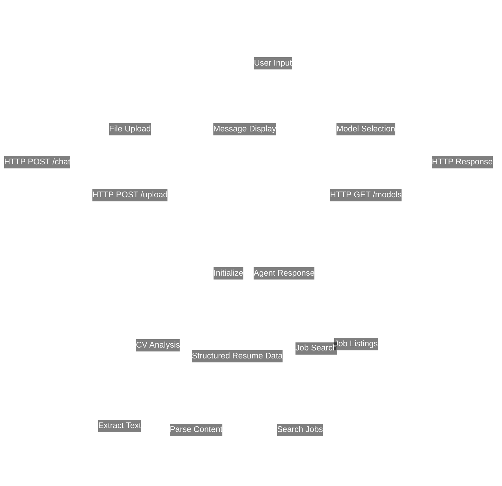

# 🤖 CareerAgent

[](https://opensource.org/licenses/MIT)
[](https://www.python.org/)
[](https://fastapi.tiangolo.com)
[](https://nextjs.org/)
[](https://www.typescriptlang.org/)
[](https://langchain.com/)
[](https://groq.com/)
[](https://pypdf2.readthedocs.io/)

**CareerAgent** is a sophisticated, AI-powered career assistant designed to streamline your job search. It leverages Large Language Models (LLMs) to analyze your resume, understand your profile, and proactively search for relevant job opportunities on LinkedIn.

> 🚀 **Quick Links**:
> - [Features](#-features)
> - [Installation](#️-environment-setup--installation)
> - [Documentation](#-project-structure)
> - [Live Demo](#-demo)

---

## 📜 Table of Contents
- [🤖 CareerAgent](#-careeragent)
  - [📜 Table of Contents](#-table-of-contents)
  - [🎥 Demo](#-demo)
  - [✨ Features](#-features)
  - [🏗️ Project Structure](#️-project-structure)
  - [🌊 Workflow](#-workflow)
  - [🛠️ Technologies \& Requirements](#️-technologies--requirements)
    - [Backend](#backend)
    - [Frontend](#frontend)
  - [⚙️ Environment Setup \& Installation](#️-environment-setup--installation)
    - [Prerequisites](#prerequisites)
    - [1. Clone the Repository](#1-clone-the-repository)
    - [2. Backend Setup (Anaconda)](#2-backend-setup-anaconda)
    - [3. Frontend Setup](#3-frontend-setup)
  - [🚀 Running the Application Locally](#-running-the-application-locally)
    - [1. Start the Backend Server](#1-start-the-backend-server)
    - [2. Start the Frontend Application](#2-start-the-frontend-application)
  - [🔮 Future Plans](#-future-plans)
  - [🙏 Acknowledgments](#-acknowledgments)
  - [📜 License](#-license)

---

## 🎥 Demo

<div align="center">
  <video src="https://github.com/user-attachments/assets/cf21777f-045b-4667-952a-b21ec82fce22" controls="controls" style="max-width: 800px;"></video>
</div>

---

## ✨ Features

- **📄 Intelligent CV Analysis**: Upload your resume (PDF) and the agent will parse its content to extract key information like skills, experience, and education.
- **🔍 Advanced Job Search**: Conducts detailed job searches on LinkedIn using multiple filters like location, experience level, company, and more.
- **💬 Conversational Interface**: Interact with the agent through a user-friendly chat interface built with Next.js and Tailwind CSS.
- **🧠 Powered by LangChain & Groq**: Utilizes the LangChain framework for agentic logic and the high-speed Groq API for LLM inference.
- **🔧 Tool-Based Agent**: The core agent uses specialized tools (`parse_cv_content`, `search_linkedin_jobs`) to perform its tasks efficiently.
- **🔄 Dynamic Model Selection**: Easily switch between different powerful language models to suit your needs.

---

## 🏗️ Project Structure

```
/home/duybaohuynhtan/CareerAgent/
├── backend/
│   ├── config.py
│   ├── cv_parser.py
│   ├── cv_parser_tool.py
│   ├── fastapi_server.py
│   ├── google_cse_linkedin_search.py
│   ├── job_search_agent.py
│   ├── linkedin_job_search_tool.py
│   ├── manual_parser.py
│   ├── models.json
│   └── schema.py
├── frontend/
│   ├── next.config.js
│   ├── package.json
│   ├── tailwind.config.js
│   ├── tsconfig.json
│   └── src/
│       ├── app/
│       │   ├── globals.css
│       │   ├── layout.tsx
│       │   └── page.tsx
│       ├── components/
│       │   ├── ChatInput.tsx
│       │   ├── ChatInterface.tsx
│       │   ├── ChatMessage.tsx
│       │   ├── FileUpload.tsx
│       │   └── ModelSelector.tsx
│       ├── lib/
│       │   └── api.ts
│       └── types/
│           └── chat.ts
├── .gitignore
├── demo.mkv
├── MyCV.pdf
├── README.md
└── requirements.txt
```

---

## 🌊 Workflow

The project operates with a simple yet powerful client-server architecture, orchestrated by an AI agent.



---

## 🛠️ Technologies & Requirements

### Backend
- **Language**: Python
- **Framework**: FastAPI
- **AI/LLM**: 
  - LangChain
  - LangChain-Groq
  - Groq
- **PDF Parsing**: PyPDF2
- **Environment**: python-dotenv
- **Server**: Uvicorn

### Frontend
- **Framework**: Next.js
- **Language**: TypeScript
- **UI Library**: React
- **Styling**: Tailwind CSS
- **UI Components**:
  - lucide-react
  - react-markdown
  - highlight.js
- **Package Manager**: npm

---

## ⚙️ Environment Setup & Installation

### Prerequisites

Before you begin, ensure you have the following installed:
- [Python](https://www.python.org/) (version 3.13 or higher)
- [Node.js](https://nodejs.org/) (version 16 or higher)
- [Anaconda](https://www.anaconda.com/) or [Miniconda](https://docs.conda.io/en/latest/miniconda.html)
- [Git](https://git-scm.com/)

You'll also need:
- A [Groq](https://groq.com/) API key
- A [Google Custom Search Engine](https://programmablesearchengine.google.com/) API key and Search Engine ID

### 1. Clone the Repository
```bash
git clone https://github.com/duybaohuynhtan/CareerAgent.git
cd CareerAgent
```

### 2. Backend Setup (Anaconda)

First, create and activate a new conda environment:
```bash
conda create --name careeragent python
conda activate careeragent
```

Next, set up your environment variables. Create a file named `.env` in the root of the project directory:
```bash
GROQ_API_KEY="your_groq_api_key"
CUSTOM_SEARCH_API_KEY="your_google_custom_search_api_key"
GOOGLE_SEARCH_ENGINE_ID="your_google_search_engine_id"
```

Finally, install the required Python packages:
```bash
pip install -r requirements.txt
```

### 3. Frontend Setup

Navigate to the frontend directory and install the npm packages:
```bash
cd frontend
npm install
```

---

## 🚀 Running the Application Locally

### 1. Start the Backend Server
Ensure you are in the `backend/` directory with your `careeragent` conda environment activated.
```bash
cd backend
uvicorn fastapi_server:app --host 0.0.0.0 --port 8000 --reload
```
The API will be available at `http://localhost:8000`.

### 2. Start the Frontend Application
In a new terminal, navigate to the `frontend/` directory.
```bash
cd frontend
npm run dev
```
The web application will be accessible at `http://localhost:3000`.

---

## 🔮 Future Plans

- **🚀 Deployment**: Deploy the application to a cloud service like Vercel (for frontend) and a cloud provider (for backend) to make it publicly accessible.
- **🔗 Enhanced Agent Chaining**: Implement a more advanced agent chain that automatically:
  1. Parses the user's CV.
  2. Extracts key skills, job titles, and experience.
  3. Uses the extracted keywords to initiate a job search without requiring manual input from the user.

---


## 🙏 Acknowledgments

- Thanks to [Groq](https://groq.com/) for their amazing LLM API
- Special thanks to the LangChain community

## 📜 License

This project is licensed under the MIT License - see the [LICENSE](LICENSE) file for details.